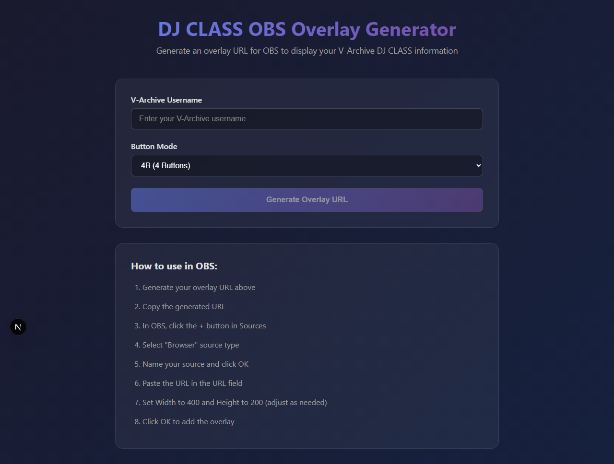
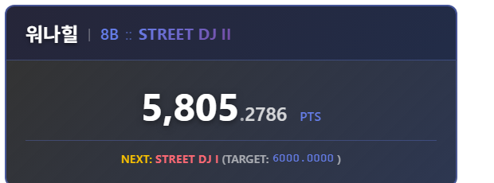

# DJ CLASS OBS Overlay



A real-time OBS overlay for V-Archive DJ CLASS data. Built with Next.js and deployed on Cloudflare Workers using the OpenNext adapter.

## Features

- **Real-time DJ CLASS Display**: Shows your V-Archive DJ CLASS rank and power points
- **Button Mode Selection**: Support for 4B, 5B, 6B, and 8B modes
- **Animated Updates**: Smooth number animations when your points change
- **Auto-refresh**: Data updates every 30 seconds
- **Transparent Background**: Perfect for OBS integration

## Screenshot



## Prerequisites

- [Node.js](https://nodejs.org/) v18 or later
- A Cloudflare account (for deployment)

## Quick Start

### Installation

```bash
npm install
```

### Local Development

Run the Next.js development server:

```bash
npm run dev
```

Open [http://localhost:3000](http://localhost:3000) to view the application.

## Project Structure

```
djclass-overlay/
├── app/                    # Next.js App Router
│   ├── api/
│   │   └── djclass/       # API route for V-Archive proxy
│   │       └── route.ts
│   ├── overlay/           # OBS overlay page
│   │   ├── page.tsx
│   │   └── overlay.module.css
│   ├── layout.tsx         # Root layout
│   ├── page.tsx           # Main page (URL generator)
│   ├── page.module.css
│   ├── globals.css
│   └── not-found.tsx
├── .open-next/            # Build output directory
├── open-next.config.ts    # OpenNext configuration
├── wrangler.toml          # Cloudflare Workers configuration
├── next.config.ts         # Next.js configuration
└── package.json
```

## Usage

### 1. Generate Your Overlay URL

1. Visit the main page (e.g., `https://your-domain.com`)
2. Enter your V-Archive username
3. Select your button mode (4B, 5B, 6B, or 8B)
4. Click "Generate Overlay URL"
5. Copy the generated URL

### 2. Add to OBS Studio

1. In OBS, click the **+** button in the Sources panel
2. Select **Browser**
3. Name your source and click **OK**
4. Paste your overlay URL in the **URL** field
5. Set dimensions:
   - **Width**: 400
   - **Height**: 200
6. Click **OK** to add the overlay

The overlay will display:
- Your username
- Button mode (4B/5B/6B/8B)
- DJ CLASS rank (e.g., SHOWSTOPPER III, BEAT MAESTRO I)
- DJ Power points with animated transitions
- Next DJ CLASS target with required power

### Features

- **Celebration Effects**: Firework animation triggers when you rank up
- **Rank Transition Animations**: Smooth visual transitions with glow effects when your DJ CLASS changes

## Deployment

### Deploy to Cloudflare Workers

This project uses `@opennextjs/cloudflare` (OpenNext adapter) to deploy on Cloudflare Workers.

```bash
# Preview locally (builds and runs in Workers runtime)
npm run preview

# Deploy to Cloudflare Workers
npm run deploy
```

### How It Works

The application is deployed as a Cloudflare Worker with Workers Assets:
- **Worker**: Handles dynamic requests (API routes, SSR)
- **Assets**: Static files served from Cloudflare's edge

## Available Scripts

```bash
npm run dev          # Start Next.js development server
npm run build        # Build for Next.js (not for deployment)
npm run preview      # Build and preview locally with Workers runtime
npm run deploy       # Build and deploy to Cloudflare Workers
npm run cf-typegen   # Generate Cloudflare types
npm run typecheck    # Run TypeScript type checking
npm run lint         # Run ESLint
```

## API

### V-Archive Proxy

Endpoint: `/api/djclass?username={user}&mode={mode}`

Proxies requests to V-Archive API and returns DJ CLASS data:

```json
{
  "djClass": "SHOWSTOPPER III",
  "djPowerConversion": 1234.5678
}
```

- **Mode**: 4B, 5B, 6B, or 8B
- **Response**: DJ CLASS rank (full name with level) and power points

### DJ CLASS Progression

The DJ CLASS system has 14 ranks with 4 levels each (I, II, III, IV), except BEGINNER and THE LORD OF DJMAX:

| Rank | IV | III | II | I |
|------|-----|-----|-----|-----|
| THE LORD OF DJMAX | - | - | - | 9980 |
| BEAT MAESTRO | 9900 | 9930 | 9950 | 9970 |
| SHOWSTOPPER | 9700 | 9750 | 9800 | 9850 |
| HEADLINER | 9400 | 9500 | 9600 | 9650 |
| TREND SETTER | 9000 | 9100 | 9200 | 9300 |
| PROFESSIONAL | 8600 | 8700 | 8800 | 8900 |
| HIGH CLASS | 7800 | 8000 | 8200 | 8400 |
| PRO DJ | 7000 | 7200 | 7400 | 7600 |
| MIDDLEMAN | 6200 | 6400 | 6600 | 6800 |
| STREET DJ | 5200 | 5500 | 5800 | 6000 |
| ROOKIE | 4000 | 4300 | 4600 | 4900 |
| AMATEUR | 2400 | 2800 | 3200 | 3600 |
| TRAINEE | 500 | 1000 | 1500 | 2000 |
| BEGINNER | 0 | - | - | - |

## Configuration

### next.config.ts

- Trailing slashes enabled for URL consistency
- Custom headers for OBS frame embedding:
  - `X-Frame-Options: ALLOWALL`
  - `Access-Control-Allow-Origin: *`
- Images are unoptimized for simpler deployment

### wrangler.toml

```toml
name = "djclass-overlay"
main = ".open-next/worker.js"
compatibility_date = "2026-04-17"
compatibility_flags = ["nodejs_compat"]

[assets]
directory = ".open-next/assets"
binding = "ASSETS"

[observability]
enabled = true
```

### open-next.config.ts

```typescript
import { defineCloudflareConfig } from "@opennextjs/cloudflare";
export default defineCloudflareConfig();
```

## Troubleshooting

### Build Failures

- Ensure Node.js v18+ is installed
- Run `npm install` to ensure all dependencies are present
- Check `npm run typecheck` for TypeScript errors

### Deployment Issues

- Verify your Cloudflare account has Workers enabled
- Check that `wrangler.toml` is properly configured
- Ensure `compatibility_date` is set to `2024-09-23` or later

### OBS Compatibility

If the overlay doesn't load in OBS:
- Verify the URL is correct and accessible
- Check browser console for CORS errors
- Ensure `X-Frame-Options: ALLOWALL` header is set (configured in `next.config.ts`)

## Technologies

- [Next.js](https://nextjs.org/) - React framework
- [React](https://react.dev/) - UI library
- [TypeScript](https://www.typescriptlang.org/) - Type safety
- [Cloudflare Workers](https://workers.cloudflare.com/) - Edge deployment
- [@opennextjs/cloudflare](https://github.com/opennextjs/opennextjs-cloudflare) - OpenNext adapter

## License

MIT
